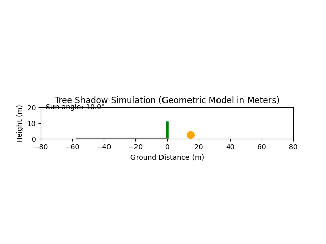

# Tree-Shadow-Simulation-Project

# 🌳 Tree Shadow Simulation

This project is a simple yet effective geometric model to visualize how the **shadow of a tree** changes throughout the day, depending on the **sun's angle**. It includes an animated visualization showing the **sun moving from 10° to 170°** and the corresponding **shadow direction and length**, based on a specified tree height.

---

## 🔍 What It Does

- Models the **shadow length and direction** based on sun elevation angle.
- Treats the tree as a vertical pole of configurable height.
- Simulates the **sun moving across the sky** from morning to afternoon.
- Shows a moving **sun disc** and **real-time shadow projection**.
- Uses **real-world units (meters)** for both height and ground distance.
- Outputs a smooth **animated GIF** showing the full process.

---

## 📽️ Example Animation

---

## 🧪 How It Works

The shadow length is computed using basic trigonometry:

