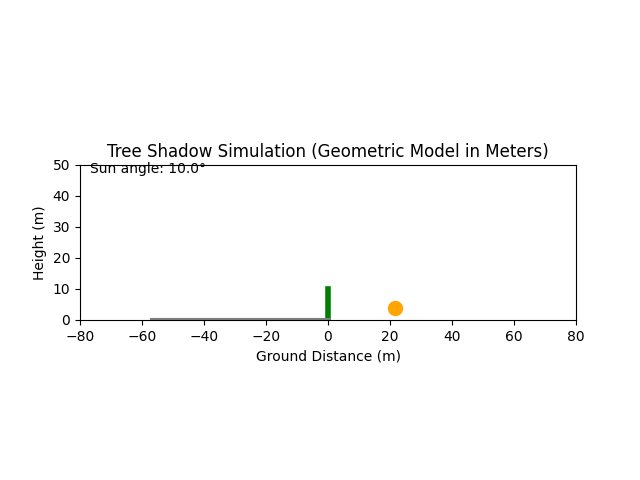

# Tree-Shadow-Simulation-Project

# 🌳 Tree Shadow Simulation

This project is a simple yet effective geometric model to visualize how the **shadow of a tree** changes throughout the day, depending on the **sun's angle**. It includes an animated visualization showing the **sun moving from 10° to 170°** and the corresponding **shadow direction and length**, based on a specified tree height.

---

## 🔍 What It Does

- Models the **shadow length and direction** based on sun elevation angle.
- Treats the tree as a vertical pole of configurable height.
- Simulates the **sun moving across the sky** from morning to afternoon.
- Shows a moving **sun disc** and **real-time shadow projection**.
- Uses **real-world units (meters)** for both height and ground distance.
- Outputs a smooth **animated GIF** showing the full process.

---

## 📽️ Example Animation



---

```
# Install required libraries
!pip install -q matplotlib

# Import libraries
import numpy as np
import matplotlib.pyplot as plt
from matplotlib.animation import FuncAnimation, PillowWriter
from IPython.display import Image

# Parameters
tree_height = 10  # meters
sun_angles = np.linspace(10, 170, 160)  # Sun from low east to low west

# Setup plot
fig, ax = plt.subplots()
ax.set_xlim(-tree_height * 8, tree_height * 8)  # Center the tree
ax.set_ylim(0, tree_height * 2)
ax.set_aspect('equal')
ax.set_title("Tree Shadow Simulation (Geometric Model in Meters)")
ax.set_xlabel("Ground Distance (m)")  # <- Unit in meters
ax.set_ylabel("Height (m)")

# Draw tree
tree_line, = ax.plot([0, 0], [0, tree_height], color='green', linewidth=4, label="Tree")

# Shadow and sun visuals
shadow_line, = ax.plot([], [], color='gray', linewidth=3, label="Shadow")
sun_point, = ax.plot([], [], 'o', color='orange', markersize=10, label="Sun")
angle_text = ax.text(0.02, 0.95, '', transform=ax.transAxes)

def update(frame):
    angle_deg = sun_angles[frame]
    angle_rad = np.radians(angle_deg)

    # Compute shadow length and direction (opposite to sun)
    shadow_length = tree_height / np.tan(angle_rad)
    shadow_x = [0, -shadow_length]  # Shadow opposite to sun
    shadow_y = [0, 0]
    shadow_line.set_data(shadow_x, shadow_y)

    # Sun position
    sun_radius = tree_height * 1.5
    sun_x = sun_radius * np.cos(angle_rad)
    sun_y = sun_radius * np.sin(angle_rad)
    sun_point.set_data([sun_x], [sun_y])

    angle_text.set_text(f'Sun angle: {angle_deg:.1f}°')
    return shadow_line, sun_point, angle_text

# Create animation
ani = FuncAnimation(fig, update, frames=len(sun_angles), interval=100, blit=True)

# Save and show
gif_filename = "tree_shadow_with_units.gif"
ani.save(gif_filename, writer=PillowWriter(fps=20))
Image(filename=gif_filename)

```

## 🧪 How It Works

The shadow length is computed using basic trigonometry:

